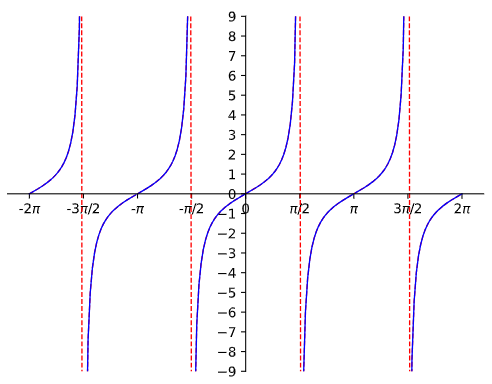
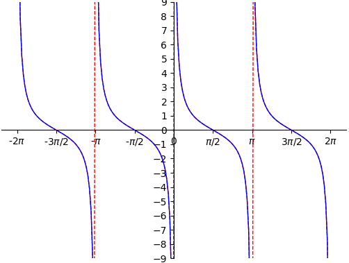
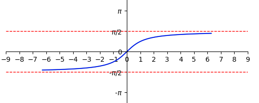
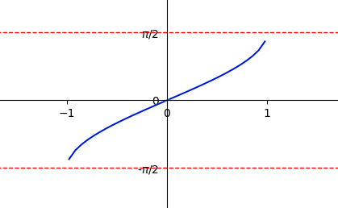
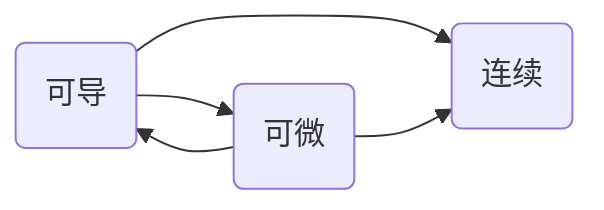

# 数二

## 常用基本公式

##### 高次公式

- $x^n-1=(x-1)(x^{n-1}+x^{n-2}+x^{n-3}+\cdot\cdot\cdot+x+1)$.
- $x^n+1=(x+1)(x^{n-1}-x^{n-2}+x^{n-3}-x^{n-4}+\cdot\cdot\cdot+x^2-x+1),n为奇数$.
- $a^3+b^3=(a+b)(a^2-ab+b^2)$.
- $a^3-b^3=(a-b)(a^2+ab+b^2)$.
- $(a+b)^n=\sum\limits_{k=0}^nC_n^k{a^{n-k}b^k},C_n^k=\frac{n!}{k!(n-k)!}$.

##### 三角函数

- 奇变偶不变，符号看象限，$\cos{(\alpha+\frac{\pi}{2})}=-\sin{\alpha},\sin{(\alpha+\frac{\pi}{2})}=\cos{\alpha}$;
- $\sin{(\alpha\pm\beta)=\sin{\alpha}\cdot\cos{\beta}\pm\cos{\alpha}\cdot\sin{\beta}}$;
- $\cos{(\alpha\pm\beta)=\cos{\alpha}\cdot\cos{\beta}\mp\sin{\alpha}\cdot\sin{\beta}}$;
- $\tan{(\alpha\pm\beta)}=\frac{\tan{\alpha}\pm\tan{\beta}}{1\mp\tan{\alpha}\cdot\tan{\beta}}$;
- $\cos^2{\alpha}=\frac{1+\cos{2\alpha}}{2}$;
- $\sin^2{\alpha}=\frac{1-\cos{2\alpha}}{2}$;
- $\sin{\alpha}=\frac{2\tan{(\alpha/2)}}{1+\tan^2{(\alpha/2)}}$;
- $\cos{\alpha}=\frac{1-\tan^2{(\alpha/2)}}{1+\tan^2{(\alpha/2)}}$;|

## 一. 函数 极限 连续

##### 三角函数图像

$\tan{x}$

$\cot{x}$

$\arctan{x}$

$arcsin{x}$

$\arccos{x}$

##### 常见奇函数

- 若$f(x)$在$x=0$处有定义，则$f(0)=0$.

- $sinx$ | $tanx$ | $arcsinx$ | $arctanx$ | $ln\frac{1-x}{1+x}$ | $ln(x+\sqrt{1+x^2})$  | $\frac{e^x-1}{e^x+1}$  | $f(x)-f(-x)$

##### 常见偶函数

- $x^2$  | $|x|$  | $cos{x}$  | $f(x)+f(-x)$  

##### 周期函数重要性质

- 若$f(x)$以$T$为周期，则$f(ax+b)$以$\frac{T}{|a|}$为周期,证明如下：

- $f(ax+b)=f(ax+b+T)=f(a*(x+\frac{T}{|a|})+b)$ 

##### 函数有界性

- 如果数列$ \{x_n\} $收敛$\longleftrightarrow$数列极限存在，那么数列$\{x_n\}$有界
- 若$\underline{\lim}\limits_{x\rightarrow x_0}f(x)$存在，则$f(x)$在$x_0$的去心领域内有界

##### 有理运算法则

1. ###### 极限：

   - 若$lim{f(x)}=A，lim{g(x)}=B$. 那么，

     $lim[f(x)\pm g(x)]=limf(x)\pm  limg(x)=A\pm B$.

     $lim[f(x)g(x)]=limf(x)\cdot limg(x)=AB$.

     $lim[\frac{f(x)}{g(x)}]=\frac{limf(x)}{limg(x)}=\frac{A}{B}(B\neq0)$.

   - $存在\pm不存在=不存在$；

     $不存在\pm不存在=不一定，例：\lim\limits{n}+\lim\limits{(-n)}=0(存在),\lim\limits{(-n)}+\lim\limits{(-n)}=-2n(不存在)$.

     $存在\times(\div)不存在=不一定，例：\lim\limits{\frac{1}{n}}\cdot \lim\limits{n}=1(存在),\lim\limits{\frac{1}{n}}\cdot \lim\limits{n^2}=n(不存在)$；

     $不存在\times(\div) 不存在=不一定，例：\lim\limits{(-1)^n}\cdot \lim\limits{(-1)^n}=n^2(存在),\lim\limits{n}\cdot \lim\limits{n}=n^2(不存在)$；

2. ###### 连续：

   - 设函数$f(x)$和$g(x)$在点$x=x_0$处连续，则$f(x)\pm g(x),f(x)*g(x),\frac{f(x)}{g(x)}(g(x_0)\neq0)$在点$x_0$处也连续
   - 设函数$u=\varphi(x)$在$x=x_0$处连续，且$\varphi(x_0)=u_0$，而函数$f(u)$在$u=u_0$处连续，则复合函数函数$f[\varphi(x)]$在$x=x_0$处连续

3. ###### 导数：

   - $(u\pm v)^{'}=u^{'}\pm v^{'}$.
   - $(uv)^{'}=u^{'}v+uv^{'}$.
   - $(\frac{u}{v})^{'}=\frac{u^{'}v-uv^{'}}{v^2}(v\neq 0)$.

##### 利用定积分定义求极限

- [ ] 待补充p31

##### 间断点

$$
间断点\begin{cases}
\text{第一类间断点（左右极限都存在）} 
	\begin{cases}
	\text{可去间断点（左右极限相等）}\\
	\text{跳跃间断点（左右极限不相等）}
	\end{cases}\\
\text{第二类间断点（左右极限至少一个不存在）}
	\begin{cases}
	\text{无穷间断点（$\underline{\lim}\limits_{x\rightarrow x_0^-}=\infty $或$\underline{\lim}\limits_{x\rightarrow x_0^+}=\infty $）}\\
	\text{振荡间断点（例如$y=sin{\frac{1}{x}}$,$x=0$处无定义,且$x\rightarrow0$时，}\\\text{函数值在-1与1之间无穷振荡）}
	\end{cases}
\end{cases}
$$

##### 闭区间上连续函数的性质

- 最值定理：设$f(x)$在闭区间[a,b]上连续，则$f(x)$在[a,b]上必有最大值与最小值
- 有界性定理：设$f(x)$在闭区间[a,b]上连续，则$f(x)$在[a,b]上必有界
- 介值定理：设$f(x)$在闭区间[a,b]上连续，且$f(a)\neq f(b)$，则对于$\forall C,C介于f(a)和f(b)之间$，至少存在一点$\xi\in(a,b)$，使得$f(\xi)=C$.
- 零点定理：设$f(x)$在闭区间[a,b]上连续，且$f(a)\cdot f(b)<0$，则至少存在一点$\xi\in(a,b)$，使得$f(\xi)=0$.

##### 复合函数的奇偶性和单调性

- 若$f(x)$单调增加，$g(x)$单调减少，则$f[f(x)]$和$g[g(x)]$都单调增加，$f[g(x)]$和$g[f(x)]$都单调减少；
- 若$f(x)$是偶函数，$g(x)$是奇函数，则$f[f(x)],f[g(x)],g[f(x)]$都是偶函数，$g[g(x)]$是奇函数

##### 洛必达法则注意事项 [(证明见下一章)](#n阶可导和n阶极限存在及n阶连续的关系)

- 若$f(x)$是n阶可导，最多只能使用到n-1阶导数

- 若$f(x)$是n阶连续可导，最多只能使用到n阶导数

  如下例，
  $$
  \pmb{设f(x)二阶可导,f(0)=0,f^{'}(0)=1,f^{''}(0)=2.求极限\underline{\lim}\limits_{x\rightarrow 0}\frac{f(x)-x}{x^2}.}
  $$

----------------------------

## 二、导数与微分

##### 导数定义形式

- $f^{'}(x_0)=\underline{\lim}\limits_{\varDelta x\rightarrow 0}\frac{\varDelta y}{\varDelta x}=\underline{\lim}\limits_{\varDelta x\rightarrow 0}\frac{f(x_0+\varDelta x)-f(x_0)}{\varDelta x}=\underline{\lim}\limits_{x\rightarrow x_0}\frac{f(x)-f(x_0)}{x-x_0}$.

- ${f^{'}(x_0)}$与$f(x_0)$的值相关，（对比$\underline{\lim}\limits_{x\rightarrow x_0}f(x)$与$f(x_0)$的值无关）

##### 微分定义形式

- 如果函数$f(x)$在$x_0$处的增量$\varDelta y=f(x+\varDelta x)-f(x)$可以表示为
  $$
  \varDelta y=A\varDelta x+o(\varDelta x),(\varDelta x\rightarrow 0)
  $$
  其中$A$是与$\varDelta x$无关的常数，则称$A\varDelta x$为$f(x)$在$x_0$处相应于自变量增量$\varDelta x$的微分，记为$\mathrm{d} y=A\varDelta x$.

- $\mathrm{d} y=f^{'}(x_0)\varDelta x=f^{'}(x_0)\mathrm{d} x$.
- 微分是函数改变量的线性主部，微小局部线性（均匀变化）代替非线性

##### 连续、可导、可微之间的关系

- 可导证连续，可导证可微，见p43

##### 常用高阶导数公式

- $(\sin{x})^{(n)}=\sin{(x+n\cdot\frac{\pi}{2})}$
- $(\cos{x})^{(n)}=\cos{(x+n\cdot\frac{\pi}{2})}$.

##### n阶可导和n阶极限存在及n阶连续的关系

- $f(x)在x_0$某领域内可导$\nrightarrow f^{'}(x)在x_0处连续$；

- $f(x)在x_0$某领域内可导$\nrightarrow \underline{\lim}\limits_{x\rightarrow x_0}{ f^{'}(x)}$存在；

- 如下例：
  $$
  \pmb{f(X)=\begin{cases}
  	x^2\cdot sin{\frac{1}{x}}& x\neq 0\\
  	0& x=0
  \end{cases},证其处处可导且以上两个结论不成立}
  $$

##### 有切线和可导的关系

- 函数在某点可导，则在该点有切线；
- 反之在某一点有切线，则不一定可导(例$y=x^{\frac{1}{3}}$)

##### 微分中值定理

$$
1.\pmb{费马定理}\begin{cases}
	\text{$f(x)$在$x_0$处导数存在}\\
	f(x)\text{在$x_0$处取得极值}
\end{cases}& \rightarrow f^{'}(x_0)=0.
$$

$$
2.\pmb{罗尔定理}\begin{cases}
	\text{$f(x)$在$[a,b]$内连续}\\
	f(x)\text{在$(a,b)$内导数存在}\\
	f(a)=f(b)
\end{cases}& \rightarrow \exists\xi\in(a,b) \text{，使得} f^{'}(\xi)=0.
$$

​									证明：最值定理（M=m,M!=m）+费马定理
$$
3.\pmb{拉格朗日中值定理}\begin{cases}
	\text{$f(x)$在$[a,b]$内连续}\\
	f(x)\text{在$(a,b)$内导数存在}
\end{cases} \rightarrow \exists\xi\in(a,b) \text{使得} \frac{f(b)-f(a)}{b-a}=f^{'}(\xi).\\
证明：构造函数g(x)=(f(b)-f(a))x-(b-a)f(x)+罗尔定理
$$

$$
4.\pmb{柯西中值定理}\begin{cases}
	\text{$f(x),F(x)$在$[a,b]$内连续}\\
	f(x),F(x)\text{在$(a,b)$内导数存在}\\
	F(x)在(a,b)之间每一点的导数均不等于0
\end{cases} \rightarrow \exists\xi\in(a,b) \text{，使得} \frac{f(b)-f(a)}{F(b)-F(a)}=\frac {f^{'}(\xi)}{F^{'}(\xi)}.\\
证明：构造函数g(x)=(f(b)-f(a))F(x)-(F(b)-F(a))f(x)+罗尔定理
$$

如何理解F(x)在(a,b)之间每一点的导数均不等于0?

##### 极值点$f^{'}(x)$&拐点$f^{''}(x)$的条件

- $f^{'}(x)=0$或不存在（极值点）
- $f^{''}(x)=0$或不存在（拐点）

##### 曲线凹凸性

​	设函数$y=f(x)$在区间$[x_1,x_2]$上连续，在$(x_1,x_2)$内二阶可导，则

- 若在$(x_1,x_2)$内有$f(x)^{''}>0$，则$f(x)$在$[x_1,x_2]$上的图形是凹的，且有$f(\frac{x_1+x_2}{2})<\frac{f(x_1)+f(x_2)}{2}$;
- 若在$(x_1,x_2)$内有$f(x)^{''}<0$，则$f(x)$在$[x_1,x_2]$上的图形是凸的，且有$f(\frac{x_1+x_2}{2})>\frac{f(x_1)+f(x_2)}{2}$.

##### 斜渐近线

- 若$f(x)可以表示为f(x)=ax+b+\alpha(x),其中\underline{\lim}\limits_{x\rightarrow \infty}\alpha(x)=0,则直线y=ax+b为曲线f(x)的斜渐近线 $

##### 曲线的弧微分&曲率

- 弧微分：$ds=\sqrt{1+(y^{'})^2}dx$
- 曲率：$k=\frac{|y^{''}|}{(1+(y^{'})^2)^{\frac{3}{2}}}$.

##### daixu

## 三、一元积分

##### 分部积分v选取

- 多项式与其他函数（三角、对数、指数），只有其他函数不好积分的情况下，才把多项式凑进微分，否则把多项式以外的部分凑进微分；

- 指数对三角，指数凑微分，连续两次还原求解

##### 原函数存在定理

- 若函数$f(x)$在区间$I$上连续，则$f(x)$在区间$I$上一定有原函数；
- 若函数$f(x)$在区间$I$上有**第一类间断点**和**无穷间断点**，则$f(x)$在区间$I$上没有原函数；
- $f(x)=\begin{cases} 2x\sin\frac{1}{x}-\cos\frac{1}{x}&,x\neq0\\0&,x=0 \end{cases}$在$x=0$处不连续，但有原函数；

##### 定积分定义

- 

##### 定积分存在的充分条件

- 

- 

- 

- 可积必有界，有界不一定可积，例$D(x)=\begin{cases}1&x为有理数\\ 0&x为无理数     \end{cases}$.

##### 积分的不等式性质

- 

- 

- 

##### 积分中值定理 (证明题，带变上限积分的极限 )

- $f(x)在[a,b]$上连续，则$\int_a^bf(x)dx=f(\xi)(b-a),(a<\xi<b)$也称$f(\xi)为f(x)在[a,b]上的平均值$.
- $f(x),g(x)在[a,b]$上连续，$g(x)不变号$，则$\int_a^bf(x)g(x)dx=f(\xi)\int_a^bg(x)dx,(a<\xi<b)$.

##### 定积分计算三大重点方法

- 奇偶性：
- 已有公式：
- 几何意义：

## 四、二重积分

##### 定义

- 设函数$z=f(x,y)$在有界闭区域$D$上有定义，将$D$任意分为$n$个小闭区域,即$\Delta\sigma_1,\Delta\sigma_2,\Delta\sigma_3,\cdot\cdot\cdot,\Delta\sigma_n$,其中$\Delta\sigma_i$表示第$i$个小闭区域，也表示其面积.在第每个$\Delta\sigma_i$上任取点$(\xi_i,\eta_i)$,作$f(\xi_i,\eta_i)\Delta\sigma_i$，表示以$\Delta\sigma$为底，以$f(\xi_i,\eta_i)$为顶的柱体体积，求和$\sum\limits_{i=1}^{n}f(\xi_i,\eta_i)\Delta\sigma_i$，设$\lambda$为$\Delta\sigma_i$中的最大直径,若极限$\lim\limits_{\lambda\rightarrow0}\sum\limits_{i=1}^{i=n}f(\xi_i,\eta_i)\Delta\sigma_i$存在，则称此极限值为函数在定义域上的**二重积分**，记为
  $$
  \iint\limits_{D}f(x,y)d\sigma=\lim\limits_{\lambda\rightarrow0}\sum\limits_{i=1}^{i=n}f(\xi_i,\eta_i)\Delta\sigma_i
  $$

##### 待续

 

