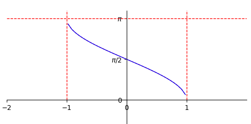

# 数二

## 常用基本公式

##### 高次公式

- $x^n-1=(x-1)(x^{n-1}+x^{n-2}+x^{n-3}+\cdot\cdot\cdot+x+1)$.
- $x^n+1=(x+1)(x^{n-1}-x^{n-2}+x^{n-3}-x^{n-4}+\cdot\cdot\cdot+x^2-x+1),n为奇数$.
- $a^3+b^3=(a+b)(a^2-ab+b^2)$.
- $a^3-b^3=(a-b)(a^2+ab+b^2)$.
- $(a+b)^n=\sum\limits_{k=0}^nC_n^k{a^{n-k}b^k},C_n^k=\frac{n!}{k!(n-k)!}$.

##### 三角函数

- 奇变偶不变，符号看象限，$\cos{(\alpha+\frac{\pi}{2})}=-\sin{\alpha},\sin{(\alpha+\frac{\pi}{2})}=\cos{\alpha}$;
- $\sin{(\alpha\pm\beta)=\sin{\alpha}\cdot\cos{\beta}\pm\cos{\alpha}\cdot\sin{\beta}}$;
- $\cos{(\alpha\pm\beta)=\cos{\alpha}\cdot\cos{\beta}\mp\sin{\alpha}\cdot\sin{\beta}}$;
- $\tan{(\alpha\pm\beta)}=\frac{\tan{\alpha}\pm\tan{\beta}}{1\mp\tan{\alpha}\cdot\tan{\beta}}$;
- $\cos^2{\alpha}=\frac{1+\cos{2\alpha}}{2}$;
- $\sin^2{\alpha}=\frac{1-\cos{2\alpha}}{2}$;
- $\sin{\alpha}=\frac{2\tan{(\alpha/2)}}{1+\tan^2{(\alpha/2)}}$;
- $\cos{\alpha}=\frac{1-\tan^2{(\alpha/2)}}{1+\tan^2{(\alpha/2)}}$;|

## 一. 函数 极限 连续

##### 三角函数图像

$\tan{x}$

$\cot{x}$

$\arctan{x}$

$arcsin{x}$

$\arccos{x}$

##### 常见奇函数

- 若$f(x)$在$x=0$处有定义，则$f(0)=0$.

- $sinx$ | $tanx$ | $arcsinx$ | $arctanx$ | $ln\frac{1-x}{1+x}$ | $ln(x+\sqrt{1+x^2})$  | $\frac{e^x-1}{e^x+1}$  | $f(x)-f(-x)$

##### 常见偶函数

- $x^2$  | $|x|$  | $cos{x}$  | $f(x)+f(-x)$  

##### 周期函数重要性质

- 若$f(x)$以$T$为周期，则$f(ax+b)$以$\frac{T}{|a|}$为周期,证明如下：

- $f(ax+b)=f(ax+b+T)=f(a*(x+\frac{T}{|a|})+b)$ 

##### 函数有界性

- 如果数列$ \{x_n\} $收敛$\longleftrightarrow$数列极限存在，那么数列$\{x_n\}$有界
- 若${\lim}\limits_{x\rightarrow x_0}f(x)$存在，则$f(x)$在$x_0$的去心领域内有界

##### 有理运算法则

1. ###### 极限：

   - 若$lim{f(x)}=A，lim{g(x)}=B$. 那么，

     $lim[f(x)\pm g(x)]=limf(x)\pm  limg(x)=A\pm B$.

     $lim[f(x)g(x)]=limf(x)\cdot limg(x)=AB$.

     $lim[\frac{f(x)}{g(x)}]=\frac{limf(x)}{limg(x)}=\frac{A}{B}(B\neq0)$.

   - $存在\pm不存在=不存在$；

     $不存在\pm不存在=不一定，例：\lim\limits{n}+\lim\limits{(-n)}=0(存在),\lim\limits{(-n)}+\lim\limits{(-n)}=-2n(不存在)$.

     $存在\times(\div)不存在=不一定，例：\lim\limits{\frac{1}{n}}\cdot \lim\limits{n}=1(存在),\lim\limits{\frac{1}{n}}\cdot \lim\limits{n^2}=n(不存在)$；

     $不存在\times(\div) 不存在=不一定，例：\lim\limits{(-1)^n}\cdot \lim\limits{(-1)^n}=(-1)^{2n}(存在),\lim\limits{n}\cdot \lim\limits{n}=n^2(不存在)$

2. ###### 连续：

   - 设函数$f(x)$和$g(x)$在点$x=x_0$处连续，则$f(x)\pm g(x),f(x)*g(x),\frac{f(x)}{g(x)}(g(x_0)\neq0)$在点$x_0$处也连续
   - 设函数$u=\varphi(x)$在$x=x_0$处连续，且$\varphi(x_0)=u_0$，而函数$f(u)$在$u=u_0$处连续，则复合函数函数$f[\varphi(x)]$在$x=x_0$处连续

3. ###### 导数：

   - $(u\pm v)^{'}=u^{'}\pm v^{'}$.
   - $(uv)^{'}=u^{'}v+uv^{'}$.
   - $(\frac{u}{v})^{'}=\frac{u^{'}v-uv^{'}}{v^2}(v\neq 0)$.

##### 利用定积分定义求极限[详情见定义](#定积分定义)

- $\int_0^1f(x)dx=\lim\limits_{\lambda\rightarrow 0}\sum\limits_{i=1}^nf(\xi_i)\Delta x_i=\lim\limits_{n\rightarrow \infty}\frac{1}{n}\sum\limits_{i=1}^nf(\frac{i}{n})$.

##### 间断点

$$
间断点\begin{cases}
\text{第一类间断点（左右极限都存在）} 
	\begin{cases}
	\text{可去间断点（左右极限相等）}\\
	\text{跳跃间断点（左右极限不相等）}
	\end{cases}\\
\text{第二类间断点（左右极限至少一个不存在）}
	\begin{cases}
	\text{无穷间断点（${\lim}\limits_{x\rightarrow x_0^-}=\infty $或${\lim}\limits_{x\rightarrow x_0^+}=\infty $）}\\
	\text{振荡间断点（例如$y=sin{\frac{1}{x}}$,$x=0$处无定义,且$x\rightarrow0$时，}\\\text{函数值在-1与1之间无穷振荡）}
	\end{cases}
\end{cases}
$$

##### 闭区间上连续函数的性质

- 最值定理：设$f(x)$在闭区间[a,b]上连续，则$f(x)$在[a,b]上必有最大值与最小值
- 有界性定理：设$f(x)$在闭区间[a,b]上连续，则$f(x)$在[a,b]上必有界
- 介值定理：设$f(x)$在闭区间[a,b]上连续，且$f(a)\neq f(b)$，则对于$\forall C,C介于f(a)和f(b)之间$，至少存在一点$\xi\in(a,b)$，使得$f(\xi)=C$.
- 零点定理：设$f(x)$在闭区间[a,b]上连续，且$f(a)\cdot f(b)<0$，则至少存在一点$\xi\in(a,b)$，使得$f(\xi)=0$.

##### 复合函数的奇偶性和单调性

- 若$f(x)$单调增加，$g(x)$单调减少，则$f[f(x)]$和$g[g(x)]$都单调增加，$f[g(x)]$和$g[f(x)]$都单调减少；
- 若$f(x)$是偶函数，$g(x)$是奇函数，则$f[f(x)],f[g(x)],g[f(x)]$都是偶函数，$g[g(x)]$是奇函数

##### 洛必达法则注意事项 [(证明见下一章)](#n阶可导和n阶极限存在及n阶连续的关系)

- 若$f(x)$是n阶可导，最多只能使用到n-1阶导数

- 若$f(x)$是n阶连续可导，最多只能使用到n阶导数

  如下例，
  $$
  \pmb{设f(x)二阶可导,f(0)=0,f^{'}(0)=1,f^{''}(0)=2.求极限{\lim}\limits_{x\rightarrow 0}\frac{f(x)-x}{x^2}.}
  $$

----------------------------

## 二、导数与微分

##### 导数定义形式

- $f^{'}(x_0)={\lim}\limits_{\varDelta x\rightarrow 0}\frac{\varDelta y}{\varDelta x}={\lim}\limits_{\varDelta x\rightarrow 0}\frac{f(x_0+\varDelta x)-f(x_0)}{\varDelta x}={\lim}\limits_{x\rightarrow x_0}\frac{f(x)-f(x_0)}{x-x_0}$.

- ${f^{'}(x_0)}$与$f(x_0)$的值相关，（对比$\underline{\lim}\limits_{x\rightarrow x_0}f(x)$与$f(x_0)$的值无关）

##### 微分定义形式

- 如果函数$f(x)$在$x_0$处的增量$\varDelta y=f(x+\varDelta x)-f(x)$可以表示为
  $$
  \varDelta y=A\varDelta x+o(\varDelta x),(\varDelta x\rightarrow 0)
  $$
  其中$A$是与$\varDelta x$无关的常数，则称$A\varDelta x$为$f(x)$在$x_0$处相应于自变量增量$\varDelta x$的微分，记为$\mathrm{d} y=A\varDelta x$.

- $\mathrm{d} y=f^{'}(x_0)\varDelta x=f^{'}(x_0)\mathrm{d} x$.
- 微分是函数改变量的线性主部，微小局部线性（均匀变化）代替非线性

##### 连续、可导、可微之间的关系

- 可导证连续，可导证可微，见p43

##### 常用高阶导数公式

- $(\sin{x})^{(n)}=\sin{(x+n\cdot\frac{\pi}{2})}$
- $(\cos{x})^{(n)}=\cos{(x+n\cdot\frac{\pi}{2})}$.

##### n阶可导和n阶极限存在及n阶连续的关系

- $f(x)在x_0$某领域内可导$\nrightarrow f^{'}(x)在x_0处连续$；

- $f(x)在x_0$某领域内可导$\nrightarrow{\lim}\limits_{x\rightarrow x_0}{ f^{'}(x)}$存在；

- 如下例：
  $$
  \pmb{f(X)=\begin{cases}
  	x^2\cdot sin{\frac{1}{x}}& x\neq 0\\
  	0& x=0
  \end{cases},证其处处可导且以上两个结论不成立}
  $$

##### 有切线和可导的关系

- 函数在某点可导，则在该点有切线；
- 反之在某一点有切线，则不一定可导(例$y=x^{\frac{1}{3}}$)

##### 微分中值定理

$$
1.\pmb{费马定理}\begin{cases}
	\text{$f(x)$在$x_0$处导数存在}\\
	f(x)\text{在$x_0$处取得极值}
\end{cases}& \rightarrow f^{'}(x_0)=0.
$$

$$
2.\pmb{罗尔定理}\begin{cases}
	\text{$f(x)$在$[a,b]$内连续}\\
	f(x)\text{在$(a,b)$内导数存在}\\
	f(a)=f(b)
\end{cases}& \rightarrow \exists\xi\in(a,b) \text{，使得} f^{'}(\xi)=0.
$$

​									证明：最值定理（M=m,M!=m）+费马定理
$$
3.\pmb{拉格朗日中值定理}\begin{cases}
	\text{$f(x)$在$[a,b]$内连续}\\
	f(x)\text{在$(a,b)$内导数存在}
\end{cases} \rightarrow \exists\xi\in(a,b) \text{使得} \frac{f(b)-f(a)}{b-a}=f^{'}(\xi).\\
证明：构造函数g(x)=(f(b)-f(a))x-(b-a)f(x)+罗尔定理
$$

$$
4.\pmb{柯西中值定理}\begin{cases}
	\text{$f(x),F(x)$在$[a,b]$内连续}\\
	f(x),F(x)\text{在$(a,b)$内导数存在}\\
	F(x)在(a,b)之间每一点的导数均不等于0
\end{cases} \rightarrow \exists\xi\in(a,b) \text{，使得} \frac{f(b)-f(a)}{F(b)-F(a)}=\frac {f^{'}(\xi)}{F^{'}(\xi)}.\\
证明：构造函数g(x)=(f(b)-f(a))F(x)-(F(b)-F(a))f(x)+罗尔定理
$$

##### 极值点$f^{'}(x)$&拐点$f^{''}(x)$的条件

- $f^{'}(x)=0$或不存在（极值点）
- $f^{''}(x)=0$或不存在（拐点）

##### 曲线凹凸性

​	设函数$y=f(x)$在区间$[x_1,x_2]$上连续，在$(x_1,x_2)$内二阶可导，则

- 若在$(x_1,x_2)$内有$f(x)^{''}>0$，则$f(x)$在$[x_1,x_2]$上的图形是凹的，且有$f(\frac{x_1+x_2}{2})<\frac{f(x_1)+f(x_2)}{2}$;
- 若在$(x_1,x_2)$内有$f(x)^{''}<0$，则$f(x)$在$[x_1,x_2]$上的图形是凸的，且有$f(\frac{x_1+x_2}{2})>\frac{f(x_1)+f(x_2)}{2}$.

##### 斜渐近线

- 若$f(x)可以表示为f(x)=ax+b+\alpha(x),其中\underline{\lim}\limits_{x\rightarrow \infty}\alpha(x)=0,则直线y=ax+b为曲线f(x)的斜渐近线 $

##### 曲线的弧微分&曲率

- 弧微分：$ds=\sqrt{1+(y^{'})^2}dx$
- 曲率：$k=\frac{|y^{''}|}{(1+(y^{'})^2)^{\frac{3}{2}}}$.

##### daixu

## 三、一元积分

##### 分部积分v选取

- 多项式与其他函数（三角、对数、指数），只有其他函数不好积分的情况下，才把多项式凑进微分，否则把多项式以外的部分凑进微分；

- 指数对三角，指数凑微分，连续两次还原求解

##### 原函数存在定理

- 若函数$f(x)$在区间$I$上连续，则$f(x)$在区间$I$上一定有原函数；
- 若函数$f(x)$在区间$I$上有**第一类间断点**和**无穷间断点**，则$f(x)$在区间$I$上**没有**原函数；
- $f(x)=\begin{cases} 2x\sin\frac{1}{x}-\cos\frac{1}{x}&,x\neq0\\0&,x=0 \end{cases}$在$x=0$处不连续，但有原函数；

##### 定积分定义

- $\int_a^bf(x)dx=\lim\limits_{\lambda\rightarrow 0}\sum\limits_{i=0}^nf(\xi_i)\Delta x_i$.

##### 定积分存在的充分条件

- 若$f(x)$在$[a,b]$上连续，则$\int_a^bf(x)dx$必定存在；
- 若$f(x)$在$[a,b]$上有界，且只有有限个间断点，则$\int_a^bf(x)dx$必定存在
- 若$f(x)$在$[a,b]$上只有有限个第一类间断点，则$\int_a^bf(x)dx$必定存在
- 可积必有界，有界不一定可积，例$D(x)=\begin{cases}1&x为有理数\\ 0&x为无理数     \end{cases}$.

##### 积分的不等式性质

- 若在区间$[a,b]$上$f(x)\leq g(x)$,则$\int_a^bf(x)dx\leq\int_a^bg(x)dx$.
- 若$f(x)$在区间$[a,b]$上有最大值$M$和最小值$m$,则$m(b-a)\leq\int_a^bf(x)dx\leq M(b-a)$.
- $|\int_a^bf(x)dx|\leq\int_a^b|f(x)|dx$,(对比$|a+b|\leq|a|+|b|$).

##### 积分中值定理 (证明题，带变上限积分的极限 )

- $f(x)在[a,b]$上连续，则$\int_a^bf(x)dx=f(\xi)(b-a),(a<\xi<b)$也称$f(\xi)为f(x)在[a,b]上的平均值$.
- $f(x),g(x)在[a,b]$上连续，$g(x)不变号$，则$\int_a^bf(x)g(x)dx=f(\xi)\int_a^bg(x)dx,(a<\xi<b)$.

##### 定积分计算三大重点方法

- 奇偶性、周期性：

- 已有公式：

  - $$
    \int_0^{\frac{\pi}{2}}\sin^n{x}dx=\int_0^{\frac{\pi}{2}}\cos^n{x}dx=\begin{cases}\frac{n-1}{n}\cdot\frac{n-3}{n-2}\cdot...\cdot\frac{1}{2}\cdot\frac{\pi}{2}&,n\text{为正偶数}\\\frac{n-1}{n}\cdot\frac{n-3}{n-2}\cdot...\cdot\frac{2}{3}&,n\text{为正奇数} \end{cases}
    $$

  - $$
    \int_0^{\pi}xf(\sin x)=\frac{\pi}{2}\int_0^\pi f(\sin x)dx (\text{其中}f(x)\text{连续} )
    $$

- 几何意义：定积分几何意义表示面积，根据被积函数画出图形求面积也可计算定积分的值

##### 无穷区间上的反常积分

- $\int_{-\infty}^{+\infty}f(x)dx=\int_{-\infty}^{a}f(x)dx+\int_{a}^{+\infty}f(x)dx=\lim\limits_{s\rightarrow -\infty}\int_s^af(x)dx+\lim\limits_{t\rightarrow +\infty}\int_a^tf(x)dx$.

##### 比较判敛法

设$f(x),g(x)$在$[a,+\infty])上非负连续，且$0\leq f(x)\leq g(x)$，则

- $\int_a^{+\infty}g(x)dx$收敛时，$\int_a^{+\infty}f(x)dx$收敛；
- $\int_a^{+\infty}f(x)dx$发散时，$\int_a^{+\infty}g(x)dx$发散；

##### 比较判敛法的极限形式

设$f(x),g(x)$在$[a,+\infty])上非负连续，且$\lim\limits_{x\rightarrow +\infty}\frac{f(x)}{g(x)}=\lambda$，则

- 当$\lambda\neq 0$时，$\int_a^{+\infty}f(x)dx$与$\int_a^{+\infty}g(x)dx$同敛散；
- 当$\lambda=0$时，若$\int_a^{+\infty}g(x)dx$收敛，则$\int_a^{+\infty}f(x)dx$收敛；
- 当$\lambda=+\infty$时，若$\int_a^{+\infty}g(x)dx$发散，则$\int_a^{+\infty}f(x)dx$发散；

##### P积分

$$
\int_a^{+\infty}\frac{1}{x^p}dx\begin{cases}p>1&,收敛\\p\leq1&,发散\end{cases}(a>0)
$$

##### 瑕点

- 如果函数$f(x)$在$a$的任一领域内都无界，那么$a$称为函数$f(x)$的瑕点

##### 无界函数的反常积分

- $\int_{a}^{b}f(x)dx=\int_{a}^{c}f(x)dx+\int_{c}^{b}f(x)dx=\lim\limits_{s\rightarrow a^+}\int_s^cf(x)dx+\lim\limits_{t\rightarrow b^-}\int_c^tf(x)dx$.

##### 比较判敛法

设$f(x),g(x)$在$(a,b]$上非负连续，且$0\leq f(x)\leq g(x)$，$x=a$为$f(x),g(x)$的瑕点，则

- $\int_a^{b}g(x)dx$收敛时，$\int_a^{b}f(x)dx$收敛；
- $\int_a^{b}f(x)dx$发散时，$\int_a^{b}g(x)dx$发散；

##### 比较判敛法的极限形式

设$f(x),g(x)$在$(a,b]$上非负连续，且$\lim\limits_{x\rightarrow a^+}\frac{f(x)}{g(x)}=\lambda$，则

- 当$\lambda\neq 0$时，$\int_a^{b}f(x)dx$与$\int_a^{b}g(x)dx$同敛散；
- 当$\lambda=0$时，若$\int_a^{b}g(x)dx$收敛，则$\int_a^{b}f(x)dx$收敛；
- 当$\lambda=+\infty$时，若$\int_a^{b}g(x)dx$发散，则$\int_a^{b}f(x)dx$发散；

##### P积分

$$
\int_a^b\frac{a}{(x-a)^p}dx,\int_a^b\frac{a}{(b-x)^p}dx\begin{cases}p<1&，收敛\\p\geq 1&，发散 \end{cases}
$$

## 四、二重积分

##### 定义

- 设函数$z=f(x,y)$在有界闭区域$D$上有定义，将$D$任意分为$n$个小闭区域,即$\Delta\sigma_1,\Delta\sigma_2,\Delta\sigma_3,\cdot\cdot\cdot,\Delta\sigma_n$,其中$\Delta\sigma_i$表示第$i$个小闭区域，也表示其面积.在第每个$\Delta\sigma_i$上任取点$(\xi_i,\eta_i)$,作$f(\xi_i,\eta_i)\Delta\sigma_i$，表示以$\Delta\sigma$为底，以$f(\xi_i,\eta_i)$为顶的柱体体积，求和$\sum\limits_{i=1}^{n}f(\xi_i,\eta_i)\Delta\sigma_i$，设$\lambda$为$\Delta\sigma_i$中的最大直径,若极限$\lim\limits_{\lambda\rightarrow0}\sum\limits_{i=1}^{i=n}f(\xi_i,\eta_i)\Delta\sigma_i$存在，则称此极限值为函数在定义域上的**二重积分**，记为
  $$
  \iint\limits_{D}f(x,y)d\sigma=\lim\limits_{\lambda\rightarrow0}\sum\limits_{i=1}^{i=n}f(\xi_i,\eta_i)\Delta\sigma_i
  $$

##### 奇偶性

- 若积分区域$D$关于$y$轴对称，$f(x,y)$关于$x$有奇偶性，则：
  $$
  \iint\limits_{D}f(x,y)d\sigma=\begin{cases}2\iint\limits_{D_{x\geq0}}f(x,y)d\sigma&f(-x,y)=f(x,y)\\0&f(-x,y)=-f(x,y) \end{cases}
  $$

- 若积分区域$D$关于$x$轴对称，$f(x,y)$关于$y$有奇偶性，则：
  $$
  \iint\limits_{D}f(x,y)d\sigma=\begin{cases}2\iint\limits_{D_{y\geq0}}f(x,y)d\sigma&f(x,-y)=f(x,y)\\0&f(x,-y)=-f(x,y) \end{cases}
  $$

##### 对称性

​	若积分区域$D$有轮换对称性，即将$D$中$x,y$互换，积分区域不变，则：
$$
\iint\limits_{D}f(x,y)d\sigma=\iint\limits_{D}f(y,x)d\sigma
$$

##### 形心求二重积分

​	设积分区域$D$的形心坐标为$(\overline{x},\overline{y})$,则：
$$
\overline{x}=\frac{\iint\limits_{D}xdxdy}{\iint\limits_{D}dxdy} ,\overline{y}=\frac{\iint\limits_{D}ydxdy}{\iint\limits_{D}dxdy}
$$

##### 被积函数带绝对值取范围的二重积分

- 待更新

## 五、微分方程

##### 一阶微分方程

​	**第一步先将**$\pmb{\frac{dy}{dx}}$**表示出来，然后判断类型，再根据类型计算**.

- 可分离变量微分方程

  ​	可以表示为$f(y)dy=f(x)dx$形式的方程，求解方式为两边积分：
  $$
  \int f(y)dy=\int f(x)dx
  $$

- 齐次微分方程

  ​    可以表示为$\frac{dy}{dx}=\varphi(\frac{y}{x})$形式的方程，求解方式为令$\frac{y}{x}=u,则y=xu,y^{'}=u+xu^{'}$,原式可化为$u+xu^{'}=\varphi(u),即xu^{'}=\varphi(u)-u$,此方程为可分离变量微分方程

- 一阶线性微分方程

  ​    可以表示为$y^{'}+p(x)y=q(x)$形式的方程，利用通解公式求解：
  $$
  y=e^{-\int p(x)dx}[\int q(x)e^{\int p(x)dx}dx+C]
  $$

##### 可降阶的高阶方程

- 形如$y^{(n)}=f(x)$，求解方式为多次积分：
  $$
  y^{(n-2)}=\int(\int f(x)dx+C_1)dx+C_2
  $$

- 形如$y^{''}=f(x,y^{'})$，求解方式为令

$$
y^{'}=p,y^{''}=p^{'}
$$

- 形如$y^{''}=f(y,y^{'})$，求解方式为令
  $$
  y^{'}=p,y^{''}=\frac{dp}{dy}\cdot\frac{dy}{dx}=p\frac{dp}{dy}
  $$

##### 高阶线性微分方程

​	二阶线性微分方程的一般形式为
$$
y^{''}+p(x)y^{'}+q(x)y=f(x)
$$
若$f(x)\equiv0$,称上诉方程为**二阶线性齐次微分方程**，否则成为**二阶线性非齐次微分方程**。

- 线性微分方程的解的结构

  - 若$y_1(x),y_2(x)$是$y^{''}+p(x)y^{'}+q(x)y=0$的两个**线性无关**的特解，那么
    $$
    y=C_1y_1(x)+C_2y_2(x)
    $$
    是$y^{''}+p(x)y^{'}+q(x)y=0$通解；

  - 若$y^*(x)$是$y^{''}+p(x)y^{'}+q(x)y=f(x)$的特解，$y=C_1y_1(x)+C_2y_2(x)$是$y^{''}+p(x)y^{'}+q(x)y=0$的通解，那么
    $$
    y=C_1y_1(x)+C_2y_2(x)+y^*(x)
    $$
    是$y^{''}+p(x)y^{'}+q(x)y=f(x)$通解；

  - 若$y_1^*(x),y_2^*(x)$是$y^{''}+p(x)y^{'}+q(x)y=f(x)$的两个特解，那么
    $$
    y_1^*(x)-y_2^*(x)
    $$
    是$y^{''}+p(x)y^{'}+q(x)y=0$的解；

  - 若$y_1^*(x),y_2^*(x)$分别是$y^{''}+p(x)y^{'}+q(x)y=f_1(x),y^{''}+p(x)y^{'}+q(x)y=f_2(x)$的特解，那么
    $$
    y_1^*(x)+y_2^*(x)
    $$
    是$y^{''}+p(x)y^{'}+q(x)y=f_1(x)+f_2(x)$的一个特解。

##### 常系数齐次线性微分方程

​	**与**$\pmb{y^{''}=f(y,y^{'})}$**不同点在于常系数**$\pmb{y^{''}}$**的系数为常数,而**$\pmb{y^{''}=f(y,y^{'})}$**可能会以**$\pmb{yy^{''}+y^{'2}=0}$**的形式出现,非齐次和常系数**

​	一般形式为
$$
y^{"}+py^{'}+qy=0
$$
​	其特征方程为$\pmb{r^2+pr+q=0}$,设$r_1,r_2$为该方程的两个根。

- 若$r_1\neq r_2$为两个不相等的实特征根，则上诉方程的通解为
  $$
  y=C_1e^{r_1x}+C_2e^{r_2x}
  $$

- 若$r_1=r_2$为二重实特征根，则上诉方程的通解为
  $$
  y=(C_1+C_2x)e^{r_1x}
  $$
  
- 若$r_1=\alpha+i\beta,r_2=\alpha-i\beta$为一对共轭复根，则上诉方程的通解为
  $$
  y=e^{\alpha x}(C_1cos{\beta x}+C_2sin{\beta x})
  $$
  
- 

##### 常系数非齐次线性微分方程

​	一般形式为
$$
y^{"}+py^{'}+qy=f(x)
$$

- 若$f(x)=P_m(x)e^{\lambda x}$,其中$P_m$为$x$的$m$次多项式，则特解可以表示为
  $$
  y*=x^kQ_m(x)e^{\lambda x}
  $$
  其中$k$是特征方程含根$\lambda$的重复次数，$Q_(x)$是与$P_m(x)$同次的多项式；

- 若$f(x)=e^{\alpha x}[P_l^{(1)}(x)cos{\beta x}+P_n^{(2)}(x)sin{\beta x}]$,其中$P_l^{(1)},P_n^{(2)}$分别为$x$的$l$次,$n$次多项式，则特解可以表示为
  $$
  y*=x^ke^{\alpha x}[R_m^{(1)}(x)cos{\beta x}+R_m^{(2)}(x)sin{\beta x}]
  $$
  其中$k=\begin{cases}0&,\alpha+\beta i\text{不是方程的特征根}\\1&,\alpha+\beta i\text{是方程的一个特征根} \end{cases}$，$R_m^{(1)}(x),R_m^{(2)}(x)$是两个$m$次多项式,$m=max{\{l,n\}}$.

##### 待续

 

